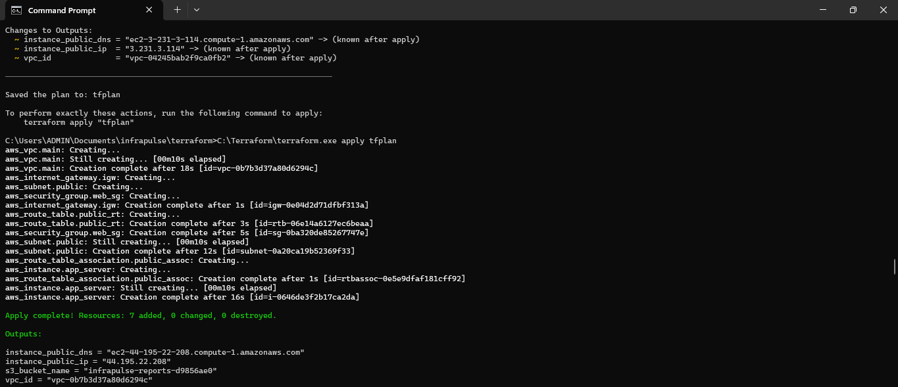
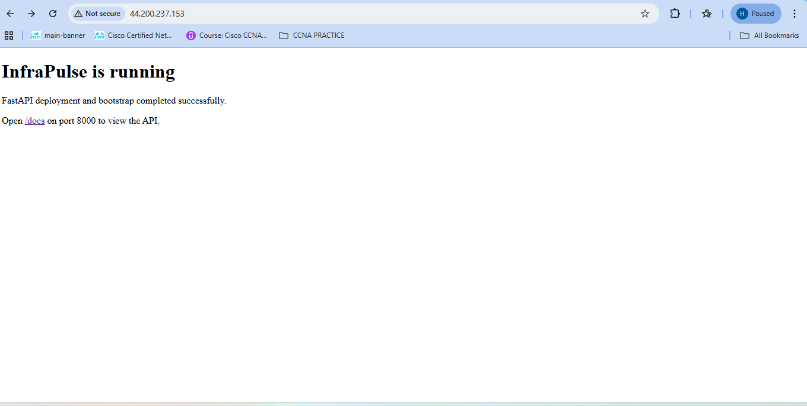
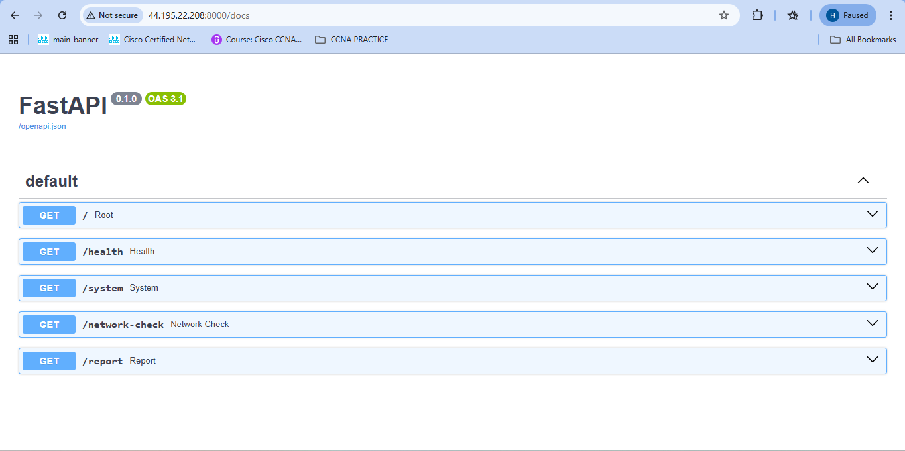
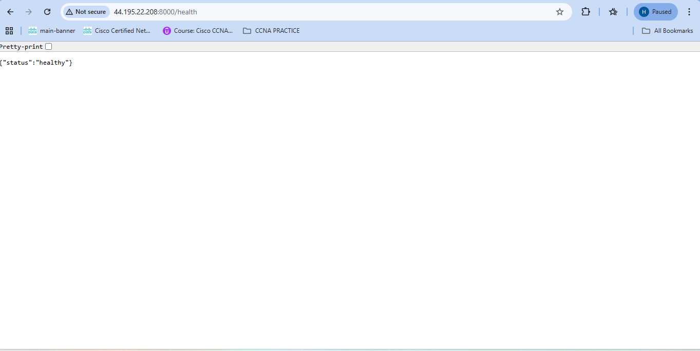
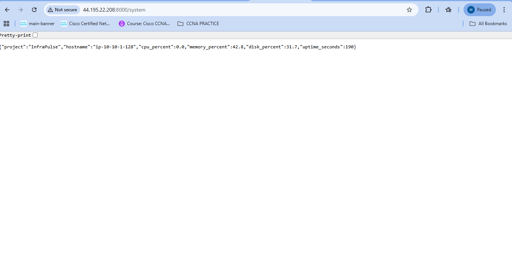
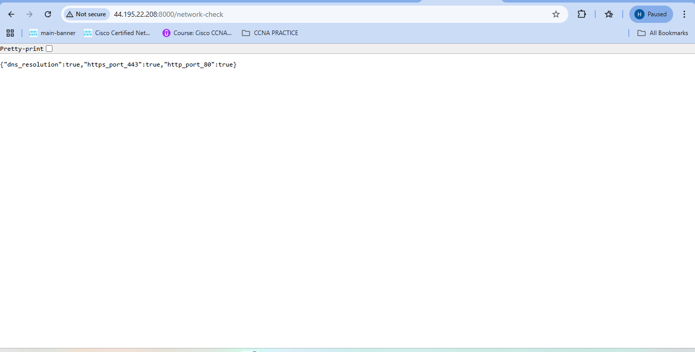
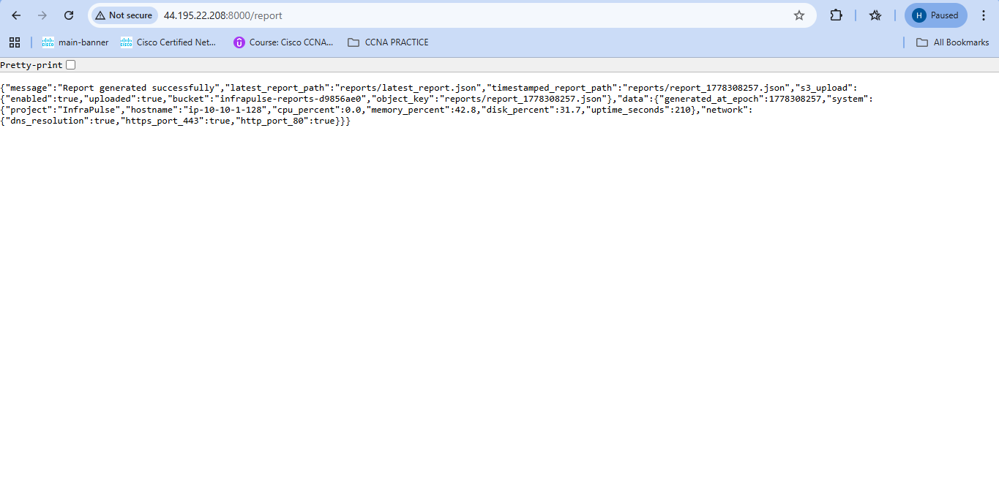
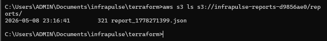
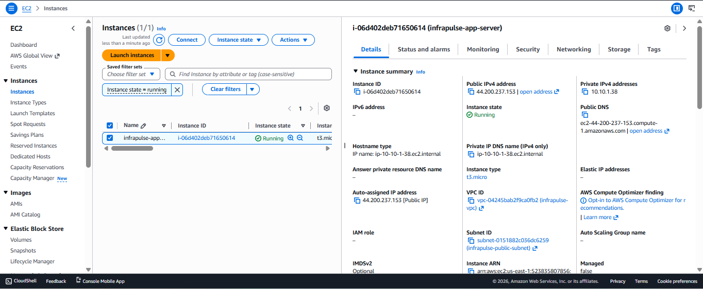
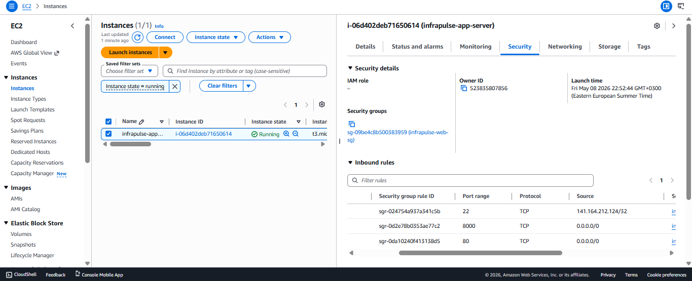

# InfraPulse

InfraPulse is a lightweight cloud operations and health audit platform built to demonstrate practical skills in AWS, Terraform, Python, Linux, APIs, monitoring, and technical documentation.

## Project Overview
The project provisions AWS infrastructure using Terraform, launches a Linux EC2 instance, bootstraps the server automatically, deploys a FastAPI application, and exposes operational endpoints for system health, network validation, report generation, and S3 upload.

This project was designed to simulate a practical junior cloud/infrastructure automation workflow with reproducible provisioning, service deployment, monitoring, and reporting.

## Problem It Solves
InfraPulse demonstrates how a small operations platform can:
- provision infrastructure automatically
- bootstrap a server without manual setup
- expose operational APIs for visibility
- generate health and network reports
- upload generated reports to cloud storage
- remain reproducible and easy to destroy for cost control

## Architecture Summary
InfraPulse uses:
- AWS VPC and public subnet
- Internet Gateway and route table
- Security Group
- Ubuntu EC2 instance
- Nginx
- FastAPI + Uvicorn
- systemd service
- S3 bucket for report storage
- IAM role and instance profile for secure S3 upload
- Terraform for Infrastructure as Code

## Architecture Diagram

For more detail, see [docs/architecture.md](docs/architecture.md).

## Key Features
- Automated AWS provisioning with Terraform
- EC2 bootstrap using `user_data.sh`
- Automatic FastAPI deployment on instance launch
- Persistent service management with `systemd`
- Health endpoint
- System metrics endpoint
- Network connectivity checks
- JSON report generation
- Automatic S3 upload for generated reports
- Clean teardown with Terraform destroy

## API Endpoints
| Endpoint | Purpose |
|---|---|
| `/` | Basic app status |
| `/health` | Health status check |
| `/system` | System resource metrics |
| `/network-check` | DNS and connectivity validation |
| `/report` | Generates JSON report and uploads it to S3 |
| `/docs` | Swagger UI for API exploration |

## Tech Stack
- AWS
- Terraform
- Python
- FastAPI
- Uvicorn
- boto3
- Linux
- Nginx
- systemd
- Git / GitHub

## Deployment Workflow
1. Terraform provisions the VPC, subnet, route table, security group, EC2 instance, S3 bucket, and IAM role.
2. EC2 launches and executes `user_data.sh`.
3. `user_data.sh` installs Python, dependencies, Nginx, and writes the app files.
4. The FastAPI service is configured and started with `systemd`.
5. The API becomes reachable on port 8000.
6. `/report` generates a JSON report and uploads it to S3 using the EC2 IAM role.

## Screenshots

### Infrastructure Provisioning

### Bootstrap Landing Page

### FastAPI Documentation

### Health Endpoint

### System Endpoint

### Network Check Endpoint

### Report Endpoint with S3 Upload Success

### S3 Upload Proof

### EC2 Instance Running

### Security Group Rules

## Skills Demonstrated
- Infrastructure as Code with Terraform
- AWS networking and compute provisioning
- Linux server provisioning and service management
- Python API development with FastAPI
- Operational monitoring and health validation
- IAM role-based secure cloud integration
- S3 automation using boto3
- Git-based project organization
- Technical documentation and project presentation

## Future Improvements
- Add authentication to the API
- Add scheduled report generation
- Add richer HTML or dashboard-based reporting
- Add logging and alerting integrations
- Move configuration into separate environment files and templates
- Add CI/CD validation for Terraform and Python code

## Repository Notes
- `terraform.tfvars` is intentionally excluded from public sharing
- use `terraform/terraform.tfvars.example` as the reference template

## Author
Omar Mohamed Mahmoud Hassan